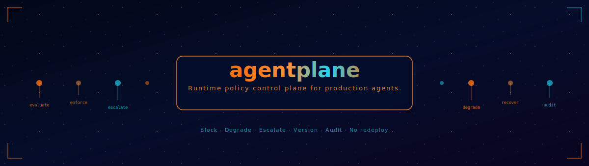

<div align="center">
  
</div>

<div align="center">

[](https://github.com/naveenkumarbaskaran/agentplane/actions/workflows/ci.yml)
[](https://pypi.org/project/agentplane-py/)
[](https://pypi.org/project/agentplane-py/)
[](LICENSE)

</div>

---

**agentplane** is the runtime policy control plane for production AI agents.

OPA, Cedar, and Casbin answer "is this allowed?" at a point in time.
agentplane answers **"how should this agent behave right now, given everything that's happened"** — and changes the answer without a redeploy.

```
wire-ai       → governance     (loops, HITL, SLA, audit)
agenthooks    → extensibility  (hookpoints, customer hooks)
agentplane    → control plane  (runtime policy, versioning, escalation)
AgentGuard    → safety         (injection, PII, toxic)
agent-gateway → routing        (protocol translation)
```

---

## Why agentplane

| | OPA / Cedar / Casbin | agentplane |
|---|---|---|
| Decision model | Static yes/no | Stateful behavioral history |
| Runtime update | Config reload | Live — no restart |
| Versioning | External | Built-in (diff, rollback, promote) |
| Escalation | None | Chain: Alert → HITL → Degrade → Block |
| Degradation | None | Modes with timed recovery |
| Agent-native | No | hookpoints, tenant_id, token/cost budgets |
| Audit | External | Append-only JSONL, every evaluation |

---

## Install

```bash
pip install agentplane-py                     # zero-dependency core
pip install "agentplane-py[otel]"             # OpenTelemetry metrics + traces
pip install "agentplane-py[sqlite]"           # persistent SQLite store
pip install "agentplane-py[sync]"             # remote service sync
pip install "agentplane-py[all]"              # everything
```

---

## Quickstart

```python
import asyncio
from agentplane import (
    PolicyEngine, Policy, Selector, PolicyContext,
    AllowlistRule, RateRule, RedactRule, AuditRule,
)

async def main():
    engine = PolicyEngine()

    engine.add_policy(Policy(
        id="acme.data-access.v1",
        selector=Selector(tenants=["acme"], tools=["sql_run", "search"]),
        blocking=[
            AllowlistRule(tools=["sql_run", "search"]),
            RateRule(limit=100, window="1h", per="tenant"),
            RedactRule(fields=["ssn", "api_key", "password"]),
        ],
        non_blocking=[AuditRule()],
        priority=100,
    ))

    ctx = PolicyContext.new(
        agent_id="my-agent",
        tenant_id="acme",
        hookpoint="before_tool_call",
        tool_name="sql_run",
    )

    await engine.evaluate(ctx)   # raises PolicyBlocked or PolicyDegraded on enforcement

asyncio.run(main())
```

---

## Blocking vs Non-Blocking Policies

```python
Policy(
    id="prod.security",
    blocking=[
        # Agent waits. Raises PolicyBlocked or PolicyDegraded on failure.
        AllowlistRule(tools=["search", "read_file"]),
        RateRule(limit=50, window="1h"),
        RedactRule(fields=["ssn", "credit_card"]),
        InjectionScanRule(),
    ],
    non_blocking=[
        # Fire-and-forget. Agent never waits. Failures are silent.
        AuditRule(include_inputs=True),
        AlertRule(channel="slack", on="breach"),
        CostTrackingRule(track_per="tenant"),
        MetricsRule(emit_otel=True),
    ],
)
```

---

## Escalation Chain

```python
from agentplane import EscalationChain, EscalationLevel, Alert, Degrade, Block, HITL

escalation = EscalationChain([
    EscalationLevel(1, trigger="rate_breach",   action=Alert(channel="log")),
    EscalationLevel(2, trigger="rate_breach",   action=Degrade(mode="rate_throttle", recover_after="10m")),
    EscalationLevel(3, trigger="rate_breach",   action=Block(reason="Repeated violations")),
])

# Stateful — tracks history. 3 breaches in 10min escalates further than 1 breach a week ago.
```

---

## Degradation Modes

```python
from agentplane.degradation.modes import DegradationMode

engine.degrade("my-agent", DegradationMode.READ_ONLY,    recover_after="30m")
engine.degrade("my-agent", DegradationMode.NO_EXTERNAL,  recover_after="1h")
engine.degrade("my-agent", DegradationMode.SAFE_TOOLS_ONLY)
engine.degrade("my-agent", DegradationMode.FULL_BLOCK)
engine.recover("my-agent")  # manual recovery
```

---

## Policy Versioning

```python
from agentplane import VersionManager

vm = VersionManager()
vm.publish(policy_v1, changelog="Initial")
vm.publish(policy_v2, changelog="Tighten rate limit")

diff = vm.diff("acme.data-access", 1, 2)
# PolicyDiff(added_blocking=['RedactRule'], removed_blocking=[], ...)

restored = vm.rollback("acme.data-access", to_version=1)
# History is preserved — rollback creates v3, not a destructive reset
```

---

## Decorators

```python
from agentplane.engine.decorators import enforce, policy_guard, require_policy

@enforce(engine, hookpoint="before_tool_call", agent_id="my-agent", tenant_id="acme")
async def run_sql(query: str) -> str:
    ...

@policy_guard(engine, agent_id="my-agent", tenant_id="acme", on_block="skip")
async def delete_record(record_id: str) -> dict:
    ...  # returns None if blocked, never raises

@require_policy(engine, "prod.data-access")
async def export_data() -> bytes:
    ...  # raises PolicyBlocked if policy not active
```

---

## Selectors — Fine-Grained Targeting

```python
Selector(agents=["*"])                              # all agents
Selector(tenants=["acme", "siemens"])               # specific tenants
Selector(tools=["sql_run", "delete_*"])             # specific tools
Selector(hookpoints=["before_tool_call"])            # specific hookpoints
Selector(tags={"env": "prod", "tier": "premium"})   # tag-based
Selector(tenants=["acme"], tools=["sql_*"], tags={"env": "prod"})  # compound
```

---

## Conflict Resolution

```python
# Default: most restrictive wins (safe enterprise default)
Policy(id="p1", conflict_resolution=ConflictResolution.MOST_RESTRICTIVE, ...)

# Override: highest priority wins when it explicitly sets a value
Policy(id="p2", conflict_resolution=ConflictResolution.PRIORITY, priority=500, ...)
```

---

## API Coverage

| Rule | Type | Description |
|---|---|---|
| `AllowlistRule` | Blocking | Tool allowlist |
| `DenylistRule` | Blocking | Tool denylist |
| `RedactRule` | Blocking | Mark fields as redacted |
| `RateRule` | Blocking | Sliding-window rate limiter |
| `RequireTenantRule` | Blocking | Tenant allowlist |
| `TokenBudgetRule` | Blocking | Token budget per window |
| `CostBudgetRule` | Blocking | USD cost budget per window |
| `ApiAllowlistRule` | Blocking | API path/method allowlist |
| `ApiDenylistRule` | Blocking | API path/method denylist |
| `InjectionScanRule` | Blocking | Prompt injection detection |
| `AuditRule` | Non-blocking | JSONL audit every evaluation |
| `AlertRule` | Non-blocking | Log / webhook alerts |
| `CostTrackingRule` | Non-blocking | Cumulative cost tracking |
| `MetricsRule` | Non-blocking | OTel metrics emission |
| `PIIScanRule` | Non-blocking | PII detection |

---

## agenthooks Integration

```python
from agenthooks import HookRegistry
from agentplane import PolicyEngine

engine = PolicyEngine()
engine.add_policy(my_policy)
engine.attach(registry)  # registers evaluation at before_tool_call + after_llm_response
```

---

## Stack

```
agentplane-py  →  zero-dep core
├── [otel]     →  OpenTelemetry metrics + traces
├── [sqlite]   →  persistent policy store
├── [sync]     →  remote service sync (httpx)
└── [service]  →  REST API (FastAPI)
```

---

<div align="center">
Apache 2.0 · Built for production enterprise agents
</div>
